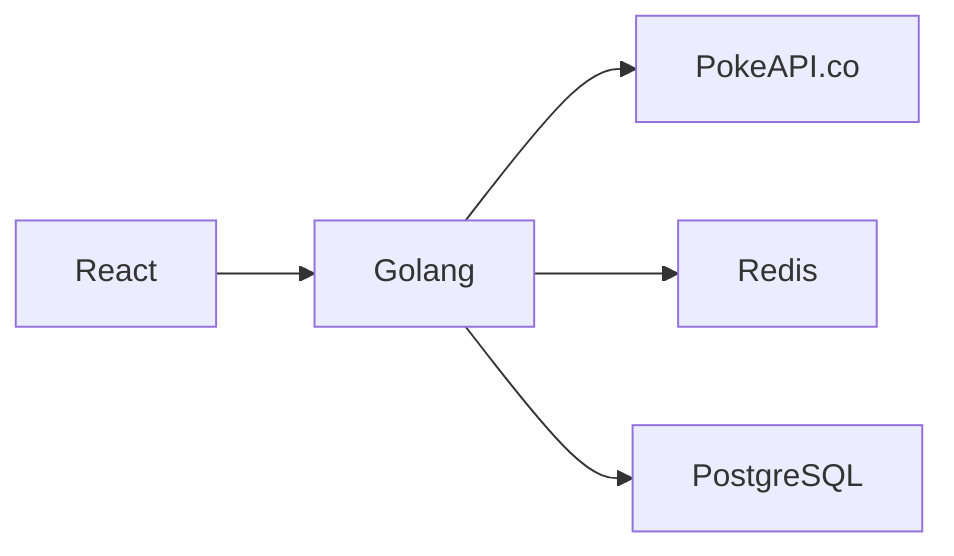

# Pokemon Battle

A full-stack application that simulates battles between Pokemon using data from [PokeAPI](https://pokeapi.co/). Enter two Pokemon names, view their ID cards with full stats, and watch them battle through a weighted stat comparison system.

## Architecture



**Backend layers:**
- **Handler**: HTTP routing, request validation, error responses
- **Service**: Business logic (Pokemon fetching + caching, battle calculation)
- **Client**: PokeAPI HTTP client with typed errors
- **Cache**: Redis with 24h TTL and graceful degradation
- **Repository**: PostgreSQL persistence using raw SQL (normalized Pokemon table with foreign keys)

## Tech Stack

| Component  | Technology             |
|------------|------------------------|
| Backend    | Go 1.24                |
| Frontend   | React 18, TypeScript   |
| Database   | PostgreSQL 16          |
| Cache      | Redis 7                |
| Container  | Docker, Docker Compose |

## Quick Start

### Prerequisites

- [Docker](https://docs.docker.com/get-docker/) and [Docker Compose](https://docs.docker.com/compose/install/)

### Run

```bash
docker compose up --build -d
```

Open [http://localhost:3000](http://localhost:3000) in your browser.

### Stop

```bash
docker compose down
```

To remove persisted data (database volume):

```bash
docker compose down -v
```

## Local Development

### Backend

```bash
cd backend
go test ./...      # Run tests
go run main.go     # Start server (requires local Postgres + Redis)
```

### Frontend

```bash
cd frontend
npm install
REACT_APP_API_URL=http://localhost:8080 npm start
```

## API Endpoints

| Method | Path                 | Description                                      |
|--------|----------------------|--------------------------------------------------|
| POST   | `/api/battle`        | Execute a battle                                 |
| GET    | `/api/battle/:id`    | Get battle by ID                                 |
| GET    | `/api/battles`       | List battle history                              |
| GET    | `/api/pokemon-names` | Autocomplete search (previously played Pokemon)  |
| GET    | `/api/pokemon/:name` | Fetch Pokemon data                               |
| GET    | `/health`            | Liveness check                                   |

### Example: Execute a Battle

```bash
curl -X POST http://localhost:8080/api/battle \
  -H "Content-Type: application/json" \
  -d '{"pokemon1": "pikachu", "pokemon2": "charizard"}'
```

## Battle Logic

The battle uses a **weighted proportional stat comparison**. Each of the six base stats is compared, and each Pokemon earns a proportional share of that stat's weight:

| Stat           | Weight |
|----------------|--------|
| HP             | 0.15   |
| Attack         | 0.20   |
| Defense        | 0.15   |
| Sp. Attack     | 0.20   |
| Sp. Defense    | 0.15   |
| Speed          | 0.15   |

**Scoring:** For each stat, the total weight is split proportionally. If Pokemon A has 100 Attack and Pokemon B has 50, A gets ~0.133 and B gets ~0.067 of the 0.20 Attack weight. The winner is whoever accumulates the higher total score.

**Tie-breakers:** Speed first, then alphabetical name order.

## Data & Caching Strategy

Pokemon data follows a three-tier lookup: **Redis cache -> PostgreSQL -> PokeAPI**. When a Pokemon is fetched from the API, it is persisted in PostgreSQL and cached in Redis (24h TTL, key: `pokemon:pikachu`). Subsequent requests are served from cache or database without hitting the external API.

The autocomplete endpoint searches only Pokemon that have been previously played (stored in the `pokemons` table), rather than loading all 1300+ names from the API.

If Redis is unavailable, the application continues to function via PostgreSQL and PokeAPI (graceful degradation).

## Design Decisions

| Decision | Rationale                                                                                         |
|----------|---------------------------------------------------------------------------------------------------|
| Normalized Pokemon table with FK references | Battles reference Pokemon by ID; avoids data duplication and keeps a single source of truth       |
| Interfaces for external dependencies | Enables unit testing without real Redis/Postgres/PokeAPI                                          |
| Graceful degradation on Redis failure | Application resilience, works slower but doesn't break                                            |
| Multi-stage Docker builds | Final images are ~15-20MB; fast builds via cached layers                                          |
| Healthchecks in Docker Compose | Proper service startup ordering without external scripts                                          |
| No ORM | For this scope, raw SQL with `lib/pq` is simpler and demonstrates SQL competence                  |

## Testing

```bash
cd backend && go test ./...
```

Tests cover:
- **Battle logic**: weighted scoring, tie-breaking, edge cases (zero stats), score consistency
- **PokeAPI client**: successful fetch, 404 handling, server errors, JSON parsing, sprite fallback
- **Pokemon service**: three-tier lookup (cache/DB/API), name normalization, DB-based autocomplete
- **HTTP handler**: request validation, error responses, health endpoint

## Project Structure

```
pokemon-battle/
├── docker-compose.yml          # Multi-service orchestration
├── Makefile                    # Convenience commands
├── backend/
│   ├── Dockerfile              # Multi-stage Go build
│   ├── main.go                 # Entry point, dependency wiring, CORS
│   ├── config/config.go        # Environment-based configuration
│   ├── migrations/             # SQL migration files
│   └── internal/
│       ├── model/              # Domain structs (Pokemon, Battle)
│       ├── client/             # PokeAPI HTTP client
│       ├── cache/              # Redis caching layer
│       ├── service/            # Business logic
│       ├── repository/         # PostgreSQL persistence
│       └── handler/            # HTTP handlers
└── frontend/
    ├── Dockerfile              # Multi-stage React build + nginx
    ├── nginx.conf              # Reverse proxy config
    └── src/
        ├── api/                # API client functions
        ├── components/         # React components
        ├── types/              # TypeScript interfaces
        └── styles/             # CSS
```
